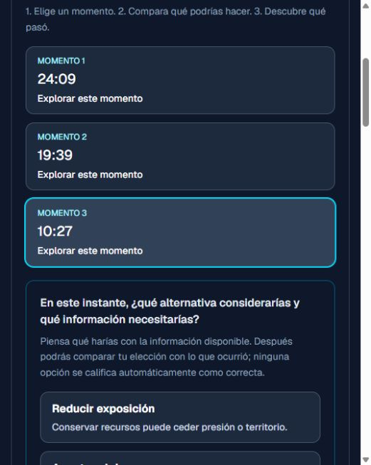

# MacroLab — análisis postpartida

Proyecto personal de **Ignacio Garrido**, Ingeniero en Informática titulado. Desarrollo propio de la aplicación; librerías, plantillas, datos e imágenes de terceros conservan su autoría.

Next.js/React y FastAPI/SQLite reunidos en un repositorio con `frontend/` y `backend/`. Analiza eventos y posiciones de una partida, propone momentos para revisar y permite guardar informes y feedback con controles de acceso.



## Primera demostración, sin backend ni credenciales
Node 22.18+:
```powershell
cd frontend
npm ci
npm run dev -- --hostname 127.0.0.1 --port 3000
```
Abre `http://127.0.0.1:3000/demo`. La partida es sintética; tus elecciones de la demo no se guardan. Para regenerarla, instala dependencias Python del backend y ejecuta desde `backend/`: `python demo.py ../frontend/src/data/demo.json`.

## Verificación
Desde `backend/`, Python 3.12+:
```powershell
python -m pip install -r requirements.txt
python -m unittest -v
python export_contract.py ../frontend/src/types/playbook.ts --check
```
Desde `frontend/`:
```powershell
npm run check
```
Verificado: 19 pruebas del backend, 4 del frontend, contrato, lint y tipos. El build se comprobó con `npm run build -- --webpack`: Turbopack no admite el enlace temporal a dependencias externas utilizado en esta revisión. Con instalación normal `npm ci`, el script build mantiene el comportamiento original. El typecheck genera primero los tipos de rutas para funcionar desde una copia limpia.

## Flujo completo local
Sigue los README de ambas carpetas. Para datos sintéticos usa `backend/dev_fixture_server.py`, puerto 8011, y el frontend en desarrollo con `ALLOW_MOCK_AUTH=true`, `MACROLAB_API_URL=http://127.0.0.1:8011` y un secreto interno local compartido. No se distribuyen secretos ni bases de usuarios.

## Límites
Las reglas permiten reflexionar sobre eventos observados; no son predicciones calibradas. Las posiciones discretas no reconstruyen todos los movimientos o la visión del jugador. No hay cobros activos ni verificación RSO. La integración real con Riot requiere clave propia y no fue ejecutada. SQLite supone un único host con disco persistente. Ver [créditos](THIRD_PARTY.md).

English: evidence-based post-match review, a credential-free synthetic demo, isolated HTTP/storage tests and a generated frontend/backend contract.
